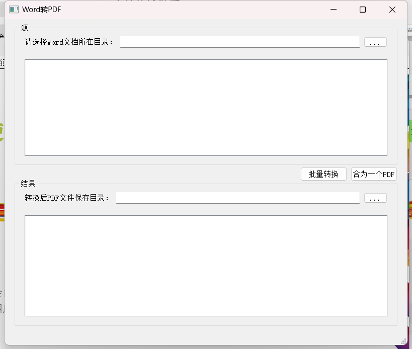

# word分析助手(word-analysis-assistant)

## 使用说明：
* 需要转换的文件不能被手动打开，防止出错
* 被选中的文件夹不能有对应的其他文件，即文件夹的文件都需满足是docx文件

## 使用截图
### 打开界面

### 第一个功能，word转pdf

### 选择输入目录以及输出目录

### 转换成功

### 查看目录进行验证，发现是成功的

### 统计每个文件页数，这里输出当前文件一页

### 提取总目录

### 查看当前目录指定文件，发现确实有将其合并成功
